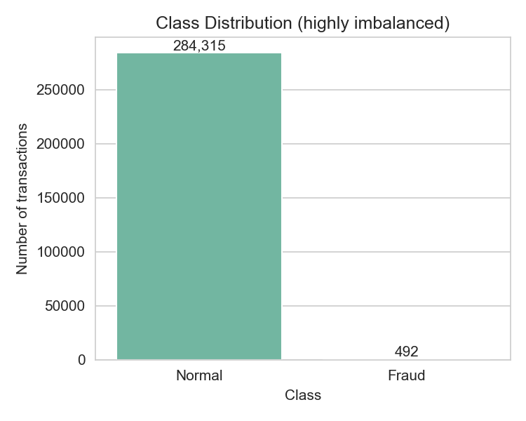
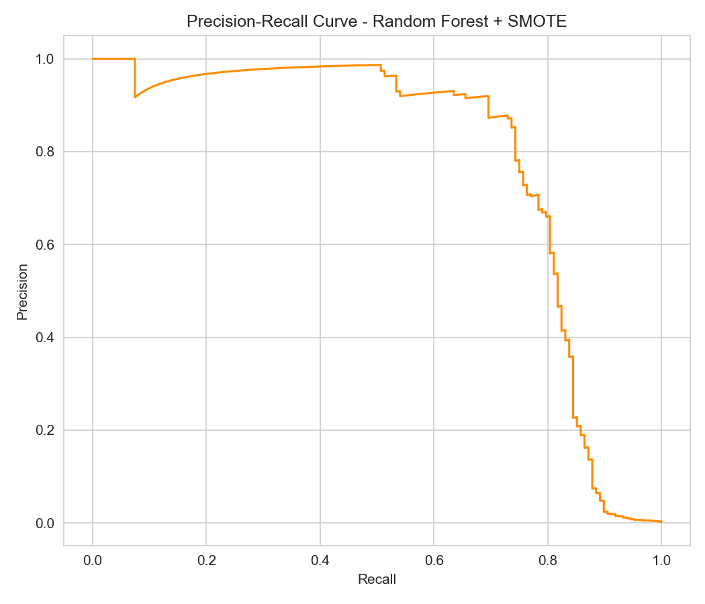
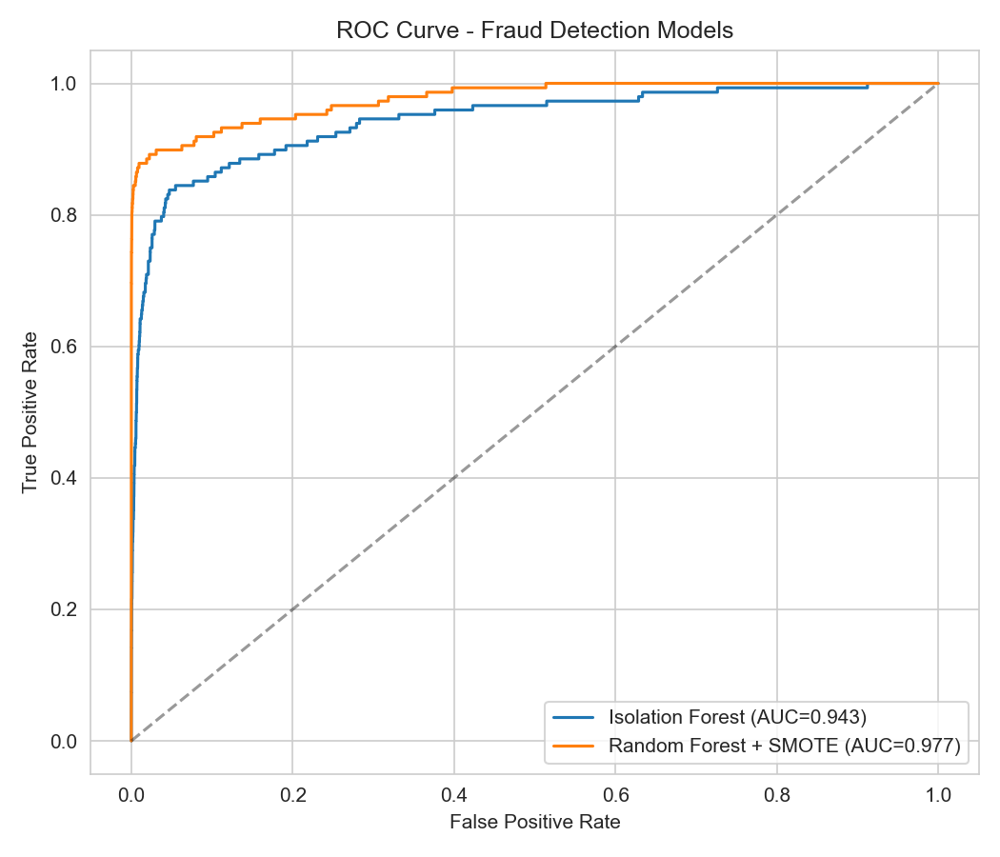
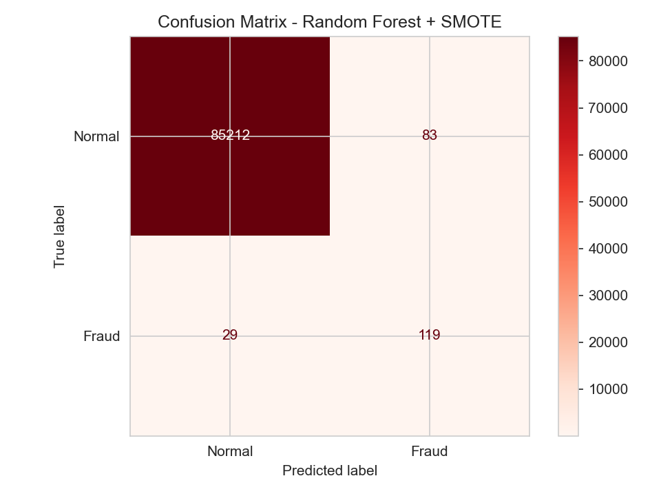

# Credit Card Fraud Detection

This project builds a classification and anomaly detection pipeline to identify fraudulent credit card transactions. 

Credit card fraud detection is notoriously challenging because fraud cases represent a tiny fraction (typically less than 0.5%) of overall transactions. This project demonstrates how to handle extreme class imbalance and build robust models for this domain.

## Methodology
To address the class imbalance, this pipeline:
- Scales PCA features ($V_1$ through $V_{28}$), transaction time, and amount.
- Uses **SMOTE** (Synthetic Minority Over-sampling Technique) to synthetically balance the training dataset.
- Evaluates and compares two distinct machine learning models:
  1. **Random Forest Classifier** (Supervised Classification)
  2. **Isolation Forest** (Unsupervised/Semi-supervised Anomaly Detection)

---

## Evaluation & Results

### 1. Class Imbalance
The dataset contains a highly skewed class distribution, which is representative of real-world transaction patterns.



---

### 2. Precision-Recall Curve
In fraud detection, Precision (avoiding false alarms) and Recall (catching all fraud cases) are critical trade-offs. The Precision-Recall AUC is the primary performance metric for this highly imbalanced dataset.



---

### 3. ROC Curve
The Receiver Operating Characteristic (ROC) curve shows the true positive rate versus the false positive rate at various classification thresholds.



---

### 4. Confusion Matrix
Displays predicted classifications vs. actual categories (Normal vs. Fraud), illustrating the classification performance on test data.



---

## How to Run

1. **Clone the repository**:
   ```bash
   git clone https://github.com/praneethkajjam/fraud-detection.git
   cd fraud-detection
   ```

2. **Install requirements**:
   ```bash
   pip install numpy pandas scikit-learn matplotlib seaborn imbalanced-learn
   ```

3. **Run the script**:
   ```bash
   python frauddetection.py
   ```
